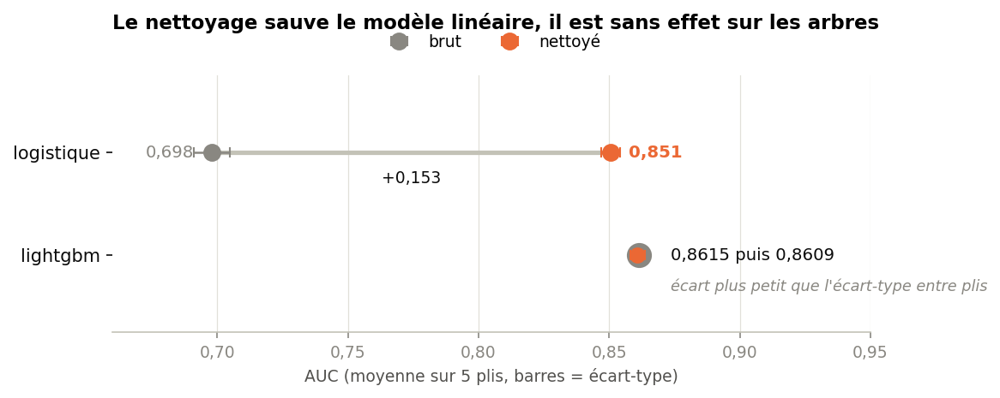
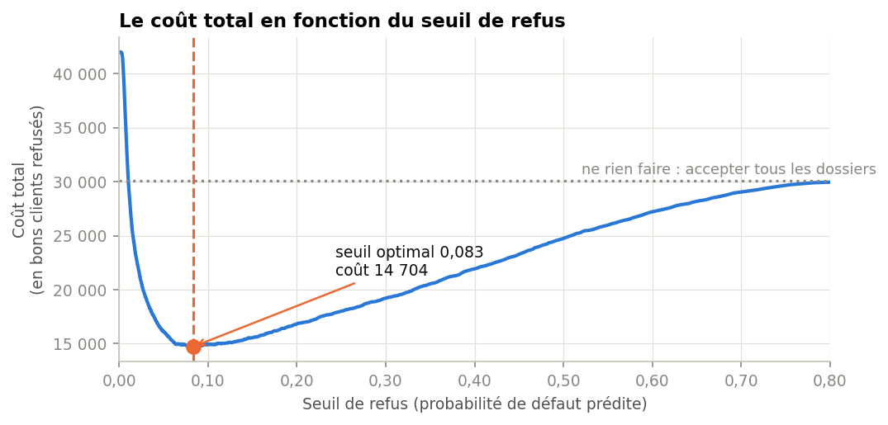

# Give Me Some Credit — du score de risque à la décision de refus

Projet Kaggle tabulaire : prédire quels emprunteurs connaîtront un incident de
paiement grave dans les deux ans, sur 150 000 dossiers.

Le modèle n'est pas le sujet. Ce dépôt s'intéresse à ce qui l'entoure : ce que
valent réellement les données, ce que le nettoyage apporte *selon
l'algorithme*, et comment un score se transforme en décision de refus chiffrée
en euros.

**Rendus :** trois notebooks et une [présentation métier](slides/presentation.html)
destinée à un public non technique.

## Résultats

| | |
|---|---|
| AUC en validation | **0,867** |
| Précision moyenne | 0,405 — six fois mieux que le hasard (0,067) |
| Justesse des refus | un dossier refusé sur quatre fait réellement défaut, contre un sur quinze au hasard |
| Défauts évités | 74 % au seuil retenu, en écartant 16 % des bons clients |
| Coût évité | 15,4 M€ sur 45 000 dossiers, sous l'hypothèse de coût retenue |

## Comparaison au classement Kaggle

Le modèle a été réentraîné sur les 150 000 dossiers étiquetés, puis soumis sur
le jeu de test de la compétition (101 503 dossiers jamais vus).

| | Ce projet | Vainqueur *Perfect Storm* | Écart |
|---|---|---|---|
| **Score privé** | **0,86847** | 0,86955 | 0,00108 |
| Score public | 0,86150 | 0,86390 | 0,00240 |

**89e sur 925 équipes au classement public**, et juste en deçà des vingt
premiers au classement privé, dont le dernier est à 0,86880.

Un millième d'AUC sépare ce projet du vainqueur. À titre de comparaison,
l'écart entre ce modèle et une régression logistique sur données brutes est de
0,17 — cent soixante fois plus. Ce dernier millième s'obtient par assemblage
de dizaines de modèles et empilement, ce qui n'a pas été tenté ici : il s'agit
d'un LightGBM unique, réglé en huit essais, sans création de variable.

**Le résultat le plus utile n'est pas le score, c'est son exactitude.**
L'estimation interne, obtenue sur 45 000 dossiers mis de côté, annonçait
**0,867**. Le jeu de test réel a donné **0,86847** — légèrement mieux
qu'annoncé. Le protocole d'évaluation (découpe stratifiée, validation croisée
à l'intérieur de l'entraînement, nettoyage réappris à chaque pli, absence de
fuite vérifiée par un test) a donc produit un chiffre fiable avant toute
confrontation aux données de test. C'est ce qu'on attend d'une évaluation :
savoir ce que vaudra le modèle avant de le déployer, pas après.

À noter enfin que le score public (0,86150) est sensiblement inférieur au
privé (0,86847). Le classement public de cette compétition portait sur une
fraction réduite du jeu de test, donc bruitée — une raison de plus de ne
jamais piloter un modèle sur un classement public.

Reproduire cette soumission : `python scripts/soumission.py`.

## Ce que l'exploration a trouvé

Trois défauts de qualité qui fausseraient un modèle entraîné sans examen
préalable — chacun démontré avant d'être corrigé, dans
[`01_eda.ipynb`](notebooks/01_eda.ipynb).

**Des codes de saisie déguisés en compteurs.** Les valeurs 96 et 98 des
compteurs d'incidents ne sont pas des retards de paiement. Elles apparaissent
sur exactement les mêmes 269 lignes dans les trois colonnes, et ces dossiers
font **54,6 % de défaut** contre 6,6 % ailleurs. Il faut neutraliser la valeur
numérique sans perdre l'information.

**Deux unités dans une même colonne.** `DebtRatio` a une médiane de 0,37 mais
un maximum de 329 664. Parmi les lignes au-dessus de 10, **92,7 % ont un revenu
manquant** : la division étant impossible, le champ contient le montant brut de
dette. Un ratio et des dollars cohabitent dans la même variable.

**Une absence qui porte du sens.** Le revenu manque pour 19,8 % des dossiers, et
ces clients font *moins* défaut (5,6 % contre 7,0 %). Une imputation par la
médiane détruirait ce signal.

## Le résultat contre-intuitif

L'effet du nettoyage dépend entièrement de l'algorithme.



Pour la régression logistique, il vaut **+0,153 d'AUC** — le modèle passe
d'inutilisable à correct. Pour LightGBM, il ne vaut **rien** : l'écart est cinq
fois plus petit que l'écart-type entre plis de validation croisée. Les arbres
isolent seuls les valeurs aberrantes et identifient les codes de saisie.

Le réglage des hyperparamètres, lui, rapporte **+0,002**. Soixante-dix fois
moins que le nettoyage n'en rapporte au modèle linéaire.

Le nettoyage reste justifié — il rend viable un modèle interprétable, et un
pipeline qui ne dépend pas de la tolérance d'un algorithme aux aberrations
survit à un changement de modèle — mais la leçon mérite d'être retenue telle
quelle : **le nettoyage n'est pas une vertu en soi.**

## Du score à la décision

Un modèle ne refuse personne, il classe. Décider suppose un seuil, et choisir
un seuil suppose de connaître le coût des deux erreurs.



En posant qu'un défaut non détecté coûte dix fois un bon client refusé à tort,
le seuil optimal est **0,083** — très proche de la valeur théorique
`1 / (1 + ratio) = 0,091`, ce qui confirme que les probabilités du modèle sont
calibrées.

L'analyse de sensibilité est la partie la plus utile du projet. Entre les
rapports 1:5 et 1:20, le nombre de dossiers refusés **plus que double**, alors
que le coût total ne varie que de 6 %. Autrement dit : le choix du seuil est une
décision commerciale, pas un pari financier — et **le paramètre le plus lourd
de conséquence ne s'estime pas à partir des données.**

## Structure

```
data/raw/          données brutes Kaggle (non versionnées)
data/processed/    jeux nettoyés au format parquet (non versionnés)
notebooks/         01_eda · 02_preparation · 03_modelisation
src/preparation.py transformateur scikit-learn portant la logique de nettoyage
tests/             22 tests sur ce transformateur
reports/figures/   les neuf figures exportées
slides/            présentation métier (HTML autonome)
```

## Reproduire

```bash
python3 -m venv .venv && source .venv/bin/activate
pip install -r requirements.txt
pip install -r requirements-dev.txt   # pour les tests
```

Les données ne sont pas versionnées, les règles de la compétition interdisant
leur redistribution. Il faut d'abord accepter ces règles sur
[la page de la compétition](https://www.kaggle.com/c/GiveMeSomeCredit/rules),
puis :

```bash
kaggle competitions download -c GiveMeSomeCredit -p data/raw
unzip data/raw/GiveMeSomeCredit.zip -d data/raw
```

Le client `kaggle` attend un couple utilisateur/clé dans `~/.kaggle/kaggle.json`.
Les tokens récents (préfixe `KGAT_`) s'envoient en Bearer et ne sont pas acceptés
par ce mécanisme ; dans ce cas :

```bash
curl -L -H "Authorization: Bearer $KAGGLE_KEY" -o data/raw/gmsc.zip \
  "https://www.kaggle.com/api/v1/competitions/data/download-all/GiveMeSomeCredit"
```

Puis exécuter les notebooks dans l'ordre, et lancer les tests :

```bash
jupyter lab
pytest
```

## Limites

- Le rapport de coût de 1 à 10 est plausible en crédit à la consommation mais
  **n'est pas mesuré** sur ces données. Le chiffrage en euros n'a de valeur
  qu'accompagné de cette hypothèse.
- Le seuil est optimisé sur le jeu de validation : sa performance réelle sur de
  nouvelles données serait légèrement inférieure.
- Ne sont traitées ni la stabilité du modèle dans le temps, ni l'équité de ses
  décisions entre catégories d'emprunteurs, ni la détection de dérive — trois
  prérequis à un déploiement réel.
